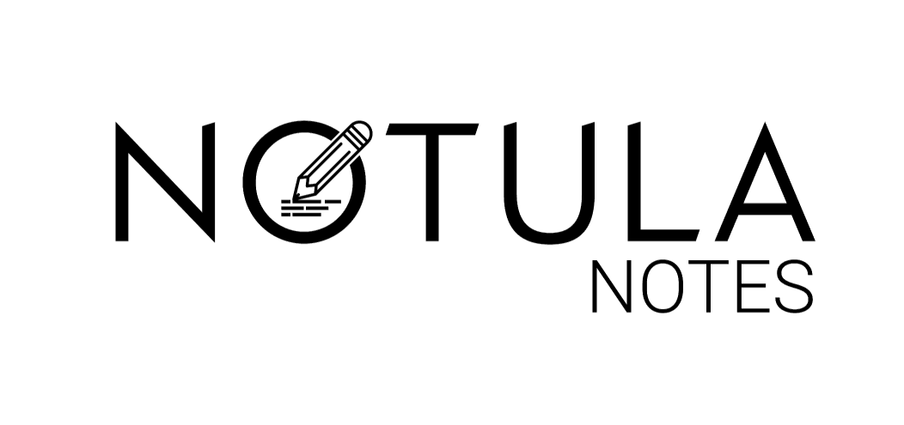
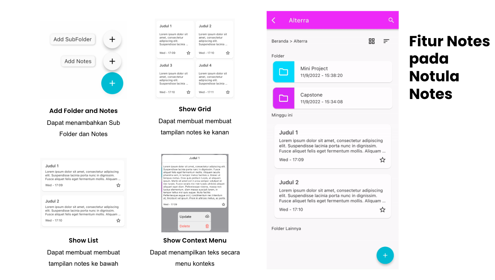

# Notula Notes

## Notula Notes

Notula Notes dibuat berdasarkan keluhan dari beberapa pengguna aplikasi notes yang merasakan bahwa tampilan aplikasi notes yang pernah mereka gunakan terlalu rumit. Dengan itu dibuatlah sebuah apliakasi pencatatan sederhana yang diberi nama Notula Notes.

Desain figma dan Power Point Notula Notes:

- [Figma](https://www.figma.com/file/p14C1UmmjloFKUPfiCqmJQ/Notula-Notes-(Copy)?node-id=163%3A137&t=x4oq3qasSv4PMCPY-0)
- [PowerPoint](https://docs.google.com/presentation/d/1Bzzj_qkWMuJm3hXpHF3ttcEBRpT_Pi_U/edit#slide=id.g18a9da29e7f_0_34)

